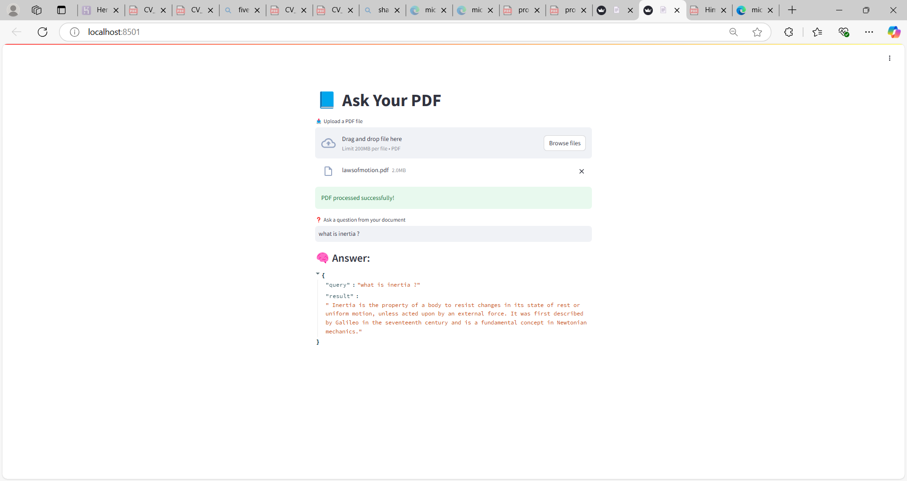

# 📘 Document_QnA_GPT: AI-Powered PDF Question Answering System

> Upload any PDF and ask questions — powered by GPT-4, FAISS & LangChain for real-time answers.

A production-ready GenAI application that allows users to upload any document (e.g., NEET chapters, HR policies, legal papers) and interact with it via natural language questions. It uses OpenAI's GPT-4, FAISS, LangChain, and Streamlit to deliver fast, contextual answers from your document.

---

## Features

- 🧾 Extracts meaningful content from PDF files
- 🔍 Performs semantic search over document chunks using FAISS
- 🤖 Answers questions using Retrieval-Augmented Generation (RAG) with OpenAI GPT
- 📊 User-friendly Streamlit UI for fast interaction
- 🔐 Securely handles API keys via `.env` integration
- 🧩 Modular, extensible architecture (ready for APIs, multi-doc search, etc.)

---

## 📁 Folder Structure

	Document_QnA_GPT/
	│
	├── app/                      # Streamlit app and core Q&A logic
	│   ├── main.py               # Embedding, FAISS indexing, QA pipeline
	│   └── streamlit_app.py      # Streamlit frontend
	│
	├── data/                     # Uploaded PDFs (excluded in .gitignore)
	│   └── lawsofmotion.pdf      # Sample file (optional)
	│
	├── utils/                    # PDF creation and helper utilities
	│   └── generate_sample_pdf.py
	│
	├── deployment/               # Future: Dockerfile, Streamlit config, etc.
	│   ├── Dockerfile            # Optional: Docker setup
	│   └── requirements.txt      # For deployment (if different)
	│
	├── tests/                    # Unit tests (optional)
	│
	├── static/                   # Assets like screenshots for README
	│   └── screenshot.png
	│
	├── .env                      # OpenAI API Key (never pushed to GitHub)
	├── .gitignore                # Ignore venv, .env, data/, etc.
	├── README.md                 # Project documentation
	├── requirements.txt          # Project dependencies
	└── venv/                     # Virtual environment (excluded)

## Use Cases

- 👨‍🎓 NEET/NCERT Chapter Assistants (Physics, Bio, Chem)
- 🏢 HR Policy Q&A
- 📑 Legal Document Understanding
- 💰 Finance & Compliance Review
- 📚 Research Paper Summarization & Analysis

---

## Tech Stack

| Tool/Library      | Purpose                         |
|-------------------|----------------------------------|
| `OpenAI GPT-4`    | Natural language understanding  |
| `LangChain`       | Retrieval-Augmented Generation  |
| `FAISS`           | Vector similarity search        |
| `pdfplumber`      | PDF parsing                     |
| `Streamlit`       | Interactive UI                  |
| `Python`          | Backend development             |

---

## Screenshot

> _User uploads a NEET Physics chapter (PDF) and asks: "What is inertia?"_

---

##  How to Run Locally

	🔹 Step 1: Clone the repository
		git clone https://github.com/himanshu-dandle/Document_QnA_GPT.git
		cd Document_QnA_GPT
	🔹 Step 2: Set up virtual environment
		python -m venv venv
		venv\Scripts\activate         # On Windows
		pip install -r requirements.txt
	🔹 Step 3: Add OpenAI Key
		Create a .env file:
		OPENAI_API_KEY=your-openai-key-here	
	🔹 Step 4: Run the app
		streamlit run app/streamlit_app.py

## 🌍 Live Demo
🚧 Coming soon: 1-click Streamlit Cloud deployment

## Future Work
 1. Add conversational memory (chat history)
 2. Support multiple PDF uploads and indexing
 3. Add unit testing and error handling
 4. REST API version using FastAPI for integration
 5. One-click deploy on Streamlit Cloud or Hugging Face Spaces
 6.  Role-based access and document privacy controls

##  Author
	Himanshu Dandle
	Email : himanshu.dandle@gmail.com

